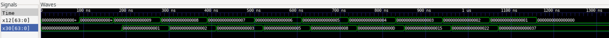
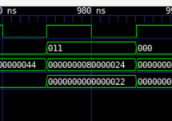
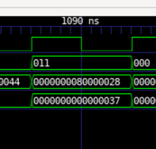
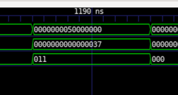
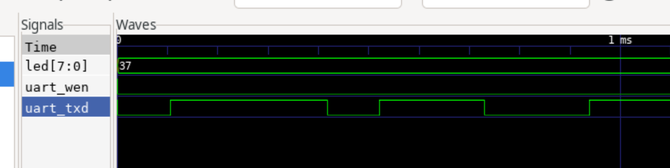
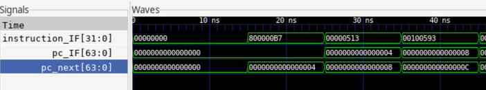

# 五级流水线 RISC-V CPU

## 目录

- [概述](#一概述)
- [运行测试](#二运行测试)
- [系统结构](#三系统架构)
- [模块组件](#四模块组件)
- [设计细节](#五设计细节)

## 一、概述

### 简介

本项目实现了一个基本的 RV64I 多周期流水线 CPU，目前具有数据前递、流水线暂停与流水线冲刷以应对数据冒险、结构冒险与控制冒险，CPU与系统总线sys_bus相连，通过系统总线与rom、dram、gpio、uart相连，目前仅实现了RV64I指令，因此CPU仅包含32个整数寄存器(不包括流水线内部寄存器及PC等)。

### 特性概览

- [x] 基本 ALU 操作（ADD、SUB、AND、OR、XOR）
- [x] 指令获取、解码、执行、访存和写回阶段
- [x] 立即数生成和处理
- [x] 寄存器文件读写操作
- [x] 加载和存储操作（LW、SW）
- [x] 跳转和分支处理（JAL、BEQ、BNE）
- [x] 系统总线，包括 ROM、DRAM 和外设
- [x] 用于流水线设计和冒险检测的控制单元
- [x] 所有 RV64I 指令的数据前递和控制冒险与结构冒险

#### 指令集

- RV64I

#### 流水站

- 取指IF
- 译码ID
- 执行EX
- 访存MEM
- 写回WB

## 二、运行测试

[测试指令介绍](../meminit/README.md)

### 1. fibnacci数列

#### (1)读取寄存器

```verilog
wire [63:0] x12;
wire [63:0] x30;
assign x12 = reg_file[12];
assign x30 = reg_file[30];
```



#### (2)写入dram

查看最后写入两个数sys_bus波形:





#### (3)写入uart





波形看起来是正确的，但是使用串口读取数据压根什么数据都没有，不知道哪里出了问题。

## 三、系统架构

### 1. 总体架构图

### 2. 数据通路

## 四、模块组件

### 1. 顶层模块

#### (1)top_module输入与输出信号

- clk:外部时钟信号
- rst:外部复位信号
- led:8位指示灯信号，连接在uart模块，指示uart运行状态
- uart_rxd:uart接收端
- uart_txd:uart发送端

#### (2)top_module模块例化

- dram_ctrl0:dram控制器，由于指令集支持读写8/16/32/64位宽度数据，为了使存储器仅保留存储功能，接近事实上的存储芯片因而分离出ctrl模块。
- dram0:dram实例，地址从0x80000000开始
- rom0:指令存储器实例，地址从0x0开始
- gpio0:计划连接在外部的gpio上，内部由数据寄存器和控制寄存器实现，`未完成`
- uart0:串口模块实例，连接在总线0x50000000地址上，使cpu得以通过串口交换数据，`功能异常`
- bus0:系统总线，通过统一地址连接rom、dram、gpio与uart，在取指阶段和访存阶段可能存在结构冒险，因此在访存操作时暂停流水线前三阶段
- reg_file0:RV64I指令集要求必须实现的32个64位整数寄存器
- data_path0:数据通路，本CPU的核心，封装流水线的五阶段与冒险处理模块和数据前递模块

### 2. 数据通路模块

#### (1)data_path输入与输出信号

```verilog
module data_path(
    input rst,
    input clk,
    // -------------到sys_bus的连线---------------------------------
    output [2:0] bus_rd_ctrl,
    output [2:0] bus_wr_ctrl,
    output [63:0] bus_addr,
    output [63:0] bus_din,
    input [63:0] bus_dout,
    
    // ------------id阶段与寄存器堆的连接信号----------------------
    input [63:0] data_reg_read_1, data_reg_read_2, // 寄存器堆返回的数据信号
    output [4:0] addr_reg_read_1, addr_reg_read_2,  // 连接源寄存器堆地址
    // --------------wb阶段的输出(与寄存器堆的连线)-----------------
    output [63:0] write_data_WB,   // 数据信号
    output [4:0] rd_WB,            // 地址信号
    output reg_write_WB,           // 使能控制信号
    // -------------------------------------------------------------
    output wire is_debug
);
```

因此在数据通路模块输入输出信号为与`系统总线`的连线和`寄存器堆`的连线，使用系统总线极大减少了数据流与外设间的连线复杂度。也许应该把寄存器堆放在data_path内部？

#### (2)data_path模块例化

在设计流水线的过程中，我只是简单的理解成五个周期是五个独立的阶段，于是划分成了IF、ID、EX、MEM、WB这样五个阶段，对比其他代码之后发现这种方式有极大的不合理性，若是以`IF_ID`的方式划分阶段，应当关注的是电平升高的一瞬间的变化（流水线寄存器），而像我这样划分关注的是从上一阶段接收数据到完成当前阶段任务并传递给下一阶段的过程。

- hazard0:主要处理控制冒险
- forwarding0:主要完成从EX、MEM、WB到ID阶段的数据前递
- stage1:取指阶段
- stage2:译码阶段
- stage3:执行阶段
- stage4:访存阶段
- stage5:写回阶段

### 3. 取指阶段

主要设计思路在于处理PC值与取指地址的处理：

- init寄存器：由于PC指向的地址要下个周期才能取出指令，因此PC值总是对应上一PC值的指令，这样在EX阶段处理跳转指令时会出问题，使用pc_next和init寄存器可以解决这个问题，init用于处理复位时读取第一条指令否则会略过第一条指令，这样设计可能不是很好的设计但是确实可以解决问题，此阶段使用了两个64位寄存器处理pc值确实浪费硬件资源。



### 4. 译码阶段

主要就是例化立即数解码模块和控制单元，然后把处理出来的控制信号使用reg锁存，供EX读取。还使用`forward_rs1_sel`等信号决定使用前递的数据还是读取寄存器的数据。

### 5. 执行阶段

例化ALU模块与Branch分支判断模块，并且锁存数据往后传递。

### 6. 访存阶段

连接内存数据线和控制线，实现内存读写。

使用memorying信号线阻塞流水线进行：

- 避免MEM阶段与IF阶段争用总线
- 读写内存通常不能在一个周期内完成，尽管使用FPGA内部虚拟出来的存储器也没什么访问延迟，实际相当于寄存器，但也得为利用ego1开发板上面的2MB dram做准备，8ns访问延迟似乎还是无法在一个周期内完成读写。

### 7. 写回阶段

- 需要根据`rf_wr_sel`信号线决定写入寄存器的数据来自哪里
- 直接将传来的控制信号与选择之后的数据接入寄存器写入信号线（地址、写使能、数据）

## 五、设计细节

### 1. 控制冒险与结构冒险

```verilog

module hazard (
  input branch_taken_EX,
  input [63:0] branch_target_EX,
  input memorying_MEM,  // 结构冒险，MEM阶段占用总线导致无法取指流水线需要暂停
  output stall_IF,
  output stall_ID,
  output stall_EX,
  output wire flush_ID,
  output wire flush_EX,
  output wire branch_taken_IF,
  output wire [63:0] branch_target_IF
);

  assign stall_IF = memorying_MEM;
  assign stall_ID = memorying_MEM;
  assign stall_EX = memorying_MEM;

  assign flush_ID = branch_taken_EX;
  assign flush_EX = branch_taken_EX;
  assign branch_taken_IF = branch_taken_EX;
  assign branch_target_IF = branch_target_EX;
  

endmodule
```

- MEM阶段占用系统总线时阻塞流水线
- 产生分支指令后冲刷流水线ID与EX阶段

### 2. 数据前推

```verilog
module forwarding (
    input [4:0] addr_reg_read_1_ID, // ID阶段寄存器读取地址1
    input [4:0] addr_reg_read_2_ID, // ID阶段寄存器读取地址2

    input [4:0] rd_EX, // EX阶段目标寄存器地址
    input rf_wr_en_EX,  // EX阶段寄存器写使能信号
    input [63:0] alu_result_EX, // EX阶段ALU结果

    input [63:0] pc_MEM, // MEM阶段时钟到来前PC地址
    input [4:0] rd_MEM, // MEM阶段目标寄存器地址
    input [2:0] dm_rd_ctrl_MEM, // MEM阶段内存读控制信号
    input [1:0] rf_wr_sel_MEM, // MEM阶段数据选择信号
    input rf_wr_en_MEM,  // MEM阶段寄存器写使能信号
    input [63:0] mem_data_MEM, // MEM阶段内存数据
    input [63:0] alu_result_MEM, // MEM阶段传递的内存读取结果

    input [4:0] rd_WB, // WB阶段目标寄存器地址
    input reg_write_WB, // WB阶段寄存器写使能信号
    input [63:0] write_data_WB, // WB阶段写入数据

    output reg [63:0] forward_rs1_data, // 前递寄存器1数据
    output reg [63:0] forward_rs2_data, // 前递寄存器2数据
    output reg forward_rs1_sel, // 前递寄存器1数据选择信号
    output reg forward_rs2_sel  // 前递寄存器2数据选择信号
);

    wire [63:0] pc_plus4_MEM;
    reg [63:0] write_data_MEM;
    assign pc_plus4_MEM = pc_MEM + 4;

    // 写回数据选择逻辑
    always @(*)
    begin
    case(rf_wr_sel_MEM)
        2'b00:  write_data_MEM = 64'h0;
        2'b01:  write_data_MEM = pc_plus4_MEM;
        2'b10:  write_data_MEM = alu_result_MEM;
        2'b11:  write_data_MEM = mem_data_MEM;
    default:write_data_MEM = 64'h0;
    endcase
    end

    // 前递逻辑：寄存器1数据
    always @(*) begin
        if (rf_wr_en_EX && (rd_EX != 5'b0) && (addr_reg_read_1_ID == rd_EX)) begin
            forward_rs1_data = alu_result_EX; // EX阶段数据转发
            forward_rs1_sel = 1'b1;
        end else if ((dm_rd_ctrl_MEM != 4'b0||rf_wr_en_MEM) && (rd_MEM != 5'b0) && (addr_reg_read_1_ID == rd_MEM)) begin
            forward_rs1_data = write_data_MEM; // MEM阶段数据转发
            forward_rs1_sel = 1'b1;
        end else if (reg_write_WB && (rd_WB != 5'b0) && (addr_reg_read_1_ID == rd_WB)) begin
            forward_rs1_data = write_data_WB; // WB阶段数据转发
            forward_rs1_sel = 1'b1;
        end else begin
            forward_rs1_data = 64'b0; // 默认值
            forward_rs1_sel = 1'b0;  // 不进行前递
        end
    end

    // 前递逻辑：寄存器2数据
    always @(*) begin
        if (rf_wr_en_EX && (rd_EX != 5'b0) && (addr_reg_read_2_ID == rd_EX)) begin
            forward_rs2_data = alu_result_EX; // EX阶段数据转发
            forward_rs2_sel = 1'b1;
        end else if ((dm_rd_ctrl_MEM != 4'b0||rf_wr_en_MEM) && (rd_MEM != 5'b0) && (addr_reg_read_2_ID == rd_MEM)) begin
            forward_rs2_data = write_data_MEM; // MEM阶段数据转发
            forward_rs2_sel = 1'b1;
        end else if (reg_write_WB && (rd_WB != 5'b0) && (addr_reg_read_2_ID == rd_WB)) begin
            forward_rs2_data = write_data_WB; // WB阶段数据转发
            forward_rs2_sel = 1'b1;
        end else begin
            forward_rs2_data = 64'b0; // 默认值
            forward_rs2_sel = 1'b0;  // 不进行前递
        end
    end

endmodule
```

模块仅包含写后读数据的处理，通过检测EX、MEM、WB阶段写入寄存器或写入内存的控制信号与比较写入寄存器的地址与读取寄存器的地址来决定是否需要前递数据。

注意前递数据的处理顺序，优先距离最近的(EX>MEM>WB)。
