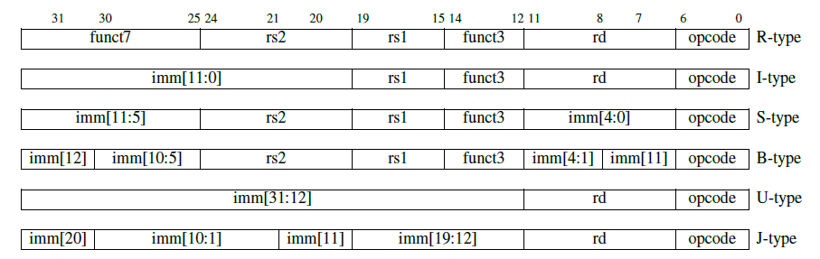

# RVCPU_DEMO

## 目录

- [简介](#简介)
- [功能](#功能)
- [运行代码](#运行代码)
- [指令集](#指令集)
- [许可证](#许可证)

## 简介

该项目是 RISC-V CPU 的DEMO，实现了核心功能并支持 RISC-V 处理器的一些典型功能。

这个文件是项目的指令集介绍以及基本实现情况，[文档](./docs/README.md)中进行介绍。

> checkout1分支中有单周期CPU的代码。

## 功能

### 已完成

- [x] 基本 ALU 操作（ADD、SUB、AND、OR、XOR）
- [x] 指令获取、解码、执行、内存和写回阶段
- [x] 立即数生成和处理
- [x] 寄存器文件读写操作
- [x] 加载和存储操作（LW、SW）
- [x] 跳转和分支处理（JAL、BEQ、BNE）
- [x] 系统总线，包括 ROM、DRAM 和外设
- [x] 用于流水线设计和冒险检测的控制单元
- [x] 所有 RV64I 指令的数据前递和控制冒险与结构冒险

### 正在进行中

- [ ] Uart串口通信
- [ ] 链接到 led 的 GPIO
- [ ] 支持其他 RISC-V 指令（例如乘法和除法）
- [ ] 指令和数据内存的缓存实现
- [ ] 异常和中断处理

### 计划实现功能

- [ ] CSR（控制和状态寄存器）支持
- [ ] 完全符合 RISC-V 特权规范

## 运行代码

> 流水线CPU仿真工具已更换为支持SystemVerilog的Verilator，需安装Verilator进行仿真，仍然可以使用[运行](#运行)这里的命令来仿真。

### 安装

目前使用 iverilog 进行模拟。

```bash
sudo apt install make iverilog gtkwave # 对于 debian/ubuntu
```

### 运行

```bash
make # 编译
make run # 生成output/waveform.vcd文件
```

然后你可以使用 gtkwave 观看波形。

## 指令集

设计为64位RISC-V架构CPU，但目前仅支持32位长度的RV64I指令集。

### RV64I

RISC-V 指令集架构 (ISA) 中，RV64I 是基本整数指令集的 64 位扩展。指令格式分为多种类型，每种类型用于不同的指令编码。以下是 U-type, B-type, R-type, I-type 和 S-type 指令格式的列表，它们分别表示了指令格式及其对应的指令。

### RISC-V 指令格式



### 指令

#### 1. U-type 指令 (Upper Immediate Type)

用于表示一个高 20 位立即数，通常用于构建绝对地址。

| 指令名  | 描述                           | 格式     |
|---------|--------------------------------|----------|
| `LUI`   | 加载高 20 位立即数             | U-type   |
| `AUIPC` | 加载高 20 位立即数，并加到 PC  | U-type   |

##### 2. B-type 指令 (Branch Type)

用于条件分支，计算分支目标地址。

| 指令名  | 描述                       | 格式     |
|---------|----------------------------|----------|
| `BEQ`   | 相等时分支                 | B-type   |
| `BNE`   | 不相等时分支               | B-type   |
| `BLT`   | 小于时分支                 | B-type   |
| `BGE`   | 大于或等于时分支           | B-type   |
| `BLTU`  | 无符号小于时分支           | B-type   |
| `BGEU`  | 无符号大于或等于时分支     | B-type   |

##### 3. R-type 指令 (Register Type)

用于寄存器之间的操作。

| 指令名  | 描述                         | 格式     |
|---------|------------------------------|----------|
| `ADD`   | 寄存器加法                   | R-type   |
| `SUB`   | 寄存器减法                   | R-type   |
| `SLL`   | 逻辑左移                     | R-type   |
| `SRL`   | 逻辑右移                     | R-type   |
| `SRA`   | 算术右移                     | R-type   |
| `SLT`   | 有符号比较                   | R-type   |
| `SLTU`  | 无符号比较                   | R-type   |
| `AND`   | 按位与                       | R-type   |
| `OR`    | 按位或                       | R-type   |
| `XOR`   | 按位异或                     | R-type   |

##### 4. I-type 指令 (Immediate Type)

用于立即数运算和内存访问。

| 指令名  | 描述                             | 格式     |
|---------|----------------------------------|----------|
| `ADDI`  | 立即数加法                       | I-type   |
| `SLTI`  | 立即数有符号比较                 | I-type   |
| `SLTIU` | 立即数无符号比较                 | I-type   |
| `ANDI`  | 立即数按位与                     | I-type   |
| `ORI`   | 立即数按位或                     | I-type   |
| `XORI`  | 立即数按位异或                   | I-type   |
| `SLLI`  | 立即数逻辑左移                   | I-type   |
| `SRLI`  | 立即数逻辑右移                   | I-type   |
| `SRAI`  | 立即数算术右移                   | I-type   |
| `LB`    | 载入一个字节                     | I-type   |
| `LH`    | 载入半字（16 位）                | I-type   |
| `LW`    | 载入一个字（32 位）              | I-type   |
| `LD`    | 载入一个双字（64 位）            | I-type   |
| `LBU`   | 载入无符号字节                   | I-type   |
| `LHU`   | 载入无符号半字（16 位）          | I-type   |
| `LWU`   | 载入无符号字（32 位）            | I-type   |
| `JALR`  | 通过寄存器跳转并链接             | I-type   |
| `ECALL` | 系统调用（进入内核态）           | I-type   |
| `EBREAK`| 调试断点                         | I-type   |

##### 5. S-type 指令 (Store Type)

用于将数据存储到内存中。

| 指令名  | 描述                         | 格式     |
|---------|------------------------------|----------|
| `SB`    | 存储一个字节                 | S-type   |
| `SH`    | 存储半字（16 位）            | S-type   |
| `SW`    | 存储一个字（32 位）          | S-type   |
| `SD`    | 存储一个双字（64 位）        | S-type   |

##### 6. J-type 指令 (Jump Type)

用于跳转指令。

| 指令名  | 描述                     | 格式     |
|---------|--------------------------|----------|
| `JAL`   | 无条件跳转并链接         | J-type   |

## 许可证

本项目采用 GPL-3.0 许可证。